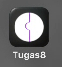
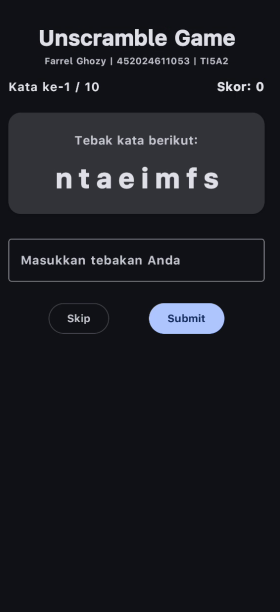

# Tugas 8 — Arsitektur Aplikasi Android (ViewModel & StateFlow)

| | |
|---|---|
| **Nama** | Farrel Ghozy |
| **NIM** | 452024611053 |
| **Kelas** | TI5A2 |

## Aplikasi Unscramble

Game tebak kata (acak huruf) berbasis **Jetpack Compose** dengan arsitektur **MVVM + UDF (Unidirectional Data Flow)**.

## Arsitektur

```
UI (Composable) ──event──> ViewModel ──state──> UI (Composable)
     │                        │
     │  collectAsState()      │  StateFlow<UiState>
     └────────────────────────┘
```

### Komponen

- **`GameViewModel`** — extends `ViewModel`, menyimpan semua logic bisnis (skor, kata acak, validasi tebakan)
- **`UiState`** — data class immutable yang diekspos via `StateFlow`
- **`StateFlow`** — `MutableStateFlow` diprivate, publik sebagai `StateFlow.asStateFlow()`
- **Composable UI** — pasif, hanya collect & render state, kirim event ke ViewModel

### Fitur

- Acak kata dari 20 kata Android/Kotlin
- Skor bertambah tiap jawaban benar
- 10 ronde per game
- Skip kata
- Game Over dialog dengan skor akhir
- **Data tetap aman saat rotasi layar** (ViewModel survive configuration changes)

## Screenshot

| Icon Aplikasi | Tampilan Aplikasi |
|:---:|:---:|
|  |  |

## Build & Run

```bash
./gradlew assembleDebug
./gradlew installDebug
```
